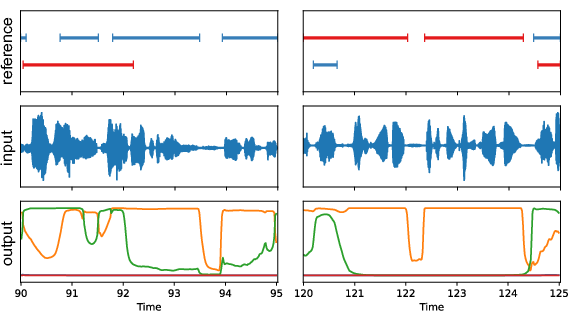

---
tags:
- pyannote
- audio
- voice
- speech
- speaker
- speaker-segmentation
- voice-activity-detection
- overlapped-speech-detection
- resegmentation
datasets:
- ami
- dihard
- voxconverse
license: mit
inference: false
---

# pyannote.audio // speaker segmentation



Model from *[End-to-end speaker segmentation for overlap-aware resegmentation](http://arxiv.org/abs/2104.04045)*,  
by Hervé Bredin and Antoine Laurent.

Relies on pyannote.audio 2.0 currently in development: see [installation instructions](https://github.com/pyannote/pyannote-audio/tree/develop#installation).

## Support

For commercial enquiries and scientific consulting, please contact [me](mailto:herve@niderb.fr).  
For [technical questions](https://github.com/pyannote/pyannote-audio/discussions) and [bug reports](https://github.com/pyannote/pyannote-audio/issues), please check [pyannote.audio](https://github.com/pyannote/pyannote-audio) Github repository.

## Basic usage

```python
from pyannote.audio import Inference
inference = Inference("pyannote/segmentation")
segmentation = inference("audio.wav")
# `segmentation` is a pyannote.core.SlidingWindowFeature
# instance containing raw segmentation scores like the 
# one pictured above (output)

from pyannote.audio.pipelines import Segmentation
pipeline = Segmentation(segmentation="pyannote/segmentation")
HYPER_PARAMETERS = {
  # onset/offset activation thresholds
  "onset": 0.5, "offset": 0.5,
  # remove speaker turn shorter than that many seconds.
  "min_duration_on": 0.0,
  # fill within speaker pauses shorter than that many seconds.
  "min_duration_off": 0.0
}

pipeline.instantiate(HYPER_PARAMETERS)
segmentation = pipeline("audio.wav")
# `segmentation` now is a pyannote.core.Annotation
# instance containing a hard binary segmentation 
# like the one picutred above (reference)
```


## Advanced usage

### Voice activity detection

```python
from pyannote.audio.pipelines import VoiceActivityDetection
pipeline = VoiceActivityDetection(segmentation="pyannote/segmentation")
pipeline.instantiate(HYPER_PARAMETERS)
vad = pipeline("audio.wav")
```

### Overlapped speech detection

```python
from pyannote.audio.pipelines import OverlappedSpeechDetection
pipeline = OverlappedSpeechDetection(segmentation="pyannote/segmentation")
pipeline.instantiate(HYPER_PARAMETERS)
osd = pipeline("audio.wav")
```

### Resegmentation

```python
from pyannote.audio.pipelines import Resegmentation
pipeline = Resegmentation(segmentation="pyannote/segmentation", 
                          diarization="baseline")
pipeline.instantiate(HYPER_PARAMETERS)
resegmented_baseline = pipeline({"audio": "audio.wav", "baseline": baseline})
# where `baseline` should be provided as a pyannote.core.Annotation instance
```

## Reproducible research 

In order to reproduce the results of the paper ["End-to-end speaker segmentation for overlap-aware resegmentation
"](https://arxiv.org/abs/2104.04045), use the following hyper-parameters:

Voice activity detection  | `onset` | `offset` | `min_duration_on` | `min_duration_off`
----------------|---------|----------|-------------------|-------------------
AMI Mix-Headset | 0.851   | 0.430    | 0.115             | 0.146
DIHARD3         | 0.855   | 0.292    | 0.036             | 0.001
VoxConverse     | 0.883   | 0.688    | 0.106             | 0.526

Overlapped speech detection | `onset` | `offset` | `min_duration_on` | `min_duration_off`
----------------|---------|----------|-------------------|-------------------
AMI Mix-Headset | 0.552   | 0.311    | 0.131             | 0.180
DIHARD3         | 0.564   | 0.264    | 0.158             | 0.080
VoxConverse     | 0.617   | 0.387    | 0.367             | 0.334

Resegmentation of VBx | `onset` | `offset` | `min_duration_on` | `min_duration_off`
----------------|---------|----------|-------------------|-------------------
AMI Mix-Headset | 0.542   | 0.527    | 0.044             | 0.705
DIHARD3         | 0.592   | 0.489    | 0.163             | 0.182
VoxConverse     | 0.537   | 0.724    | 0.410             | 0.563

Expected outputs (and VBx baseline) are also provided in the `/reproducible_research` sub-directories.

## Citation

```bibtex
@inproceedings{Bredin2020,
  Title = {{pyannote.audio: neural building blocks for speaker diarization}},
  Author = {{Bredin}, Herv{\\\\'e} and {Yin}, Ruiqing and {Coria}, Juan Manuel and {Gelly}, Gregory and {Korshunov}, Pavel and {Lavechin}, Marvin and {Fustes}, Diego and {Titeux}, Hadrien and {Bouaziz}, Wassim and {Gill}, Marie-Philippe},
  Booktitle = {ICASSP 2020, IEEE International Conference on Acoustics, Speech, and Signal Processing},
  Address = {Barcelona, Spain},
  Month = {May},
  Year = {2020},
}
```
